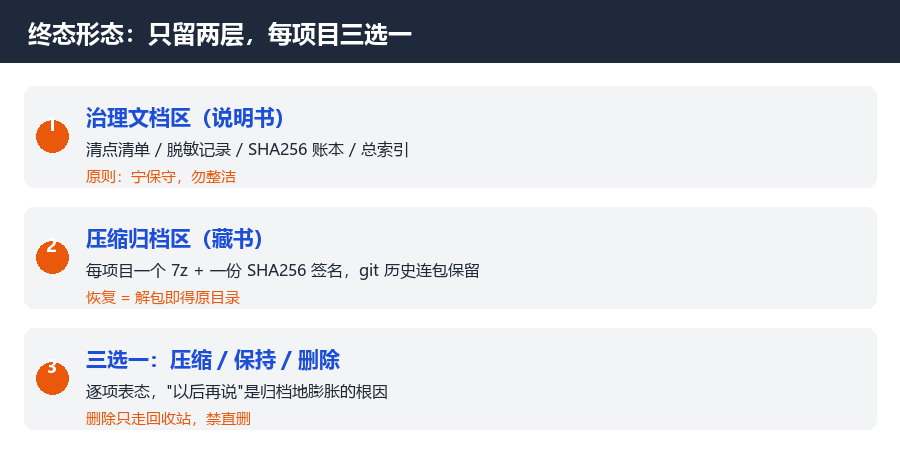
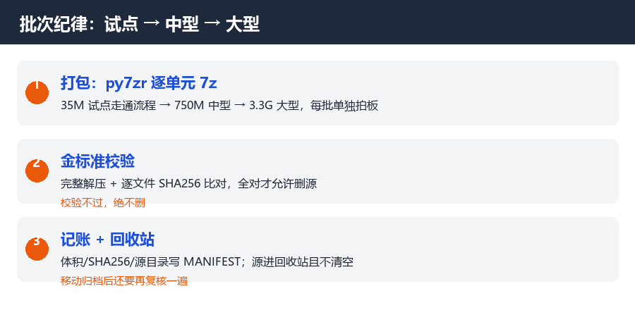

# 33 个项目的退役终点站：归档不是塞进文件夹就完事

> 摘要：硬盘里躺着 33 个过气项目。这篇讲我给归档地设计"终态"的全过程：两层形态、三选一处置表、批次纪律，以及一个真实的意外——想接管一个仓库时，发现连账号都找不回来了。

我的 D 盘上有两个"项目坟场"：一个叫 projects-old，23 个目录，4GB；一个叫 vue_front_project，22 个目录，3.3GB。里面最早的项目是 2019 年的，最晚的停在 2024 年。

坟场的问题是——你以为它安静，其实它一直在吃你的注意力。想找个东西，得靠回忆；想确认某个副本是不是最新的，得开 git 逐个 log；想备份，发现体积大到无从下手。

这篇讲我怎么给它们设计"终点站"。不是备份教程，是一个决策框架：**33 个项目，每个只有三种结局。**

## 01 归档地的三层失忆

动手之前先盘家底。清点的过程本身就抓出三个典型病：

**第一层：目录名骗人。**有个目录叫 AI_CITY，听着像智慧城市项目，打开一看是跟着教程写的仿商城 Demo。还有个 882MB 的"多语言练习杂烩"，真实内容只有 12MB，其余全是 node_modules。

**第二层：体积骗人。**一个"493MB 含文档"的仓库，文档目录其实只有 705KB，剩下 489MB 是三次 npm install 的产物。做归档决策前不先称重，会被体量吓得做出错误保守。

**第三层：出处断了。**这是最狠的一层，下文 05 节展开。

所以终点站设计的第一步不是"压缩"，而是**清点画像**：每个项目一张卡——是什么、多大、git 历史在哪、最后一次提交是什么时候、跟谁同源。23+22 个项目，每个五分钟，值得。

## 02 终态形态：只留两层，每项目三选一

清点完就要回答一个尖锐的问题：**这些目录最终以什么形态存在？**

我的答案是只留两层：**治理文档区**（清点清单、脱敏记录、SHA256 账本——归档地的"说明书"）加**压缩归档区**（每个项目一个 7z + 一份 SHA256 清单）。散装的源码目录全部消失。

每个项目在表里三选一：

**压缩**——绝大多数。git 历史连同 .git 一起打包（那是复盘的证据链），打包完做金标准校验：完整解压、逐文件 SHA256 比对，全对才允许删源。

**保持原样**——少数。治理文档、一个曾放过个人法律材料的目录、客户端托管的缓存。宁可保守。

**删除**——纯垃圾。0 字节的日志、失效的编辑器工作区指针、误落盘的测试残留。走回收站，不直删。

三选一的价值不在表格本身，在于**它逼你逐项表态**。"以后再说"是归档地膨胀的根因。

## 03 批次纪律：先试点，再大仓

19 个打包单元，我没有一口气跑完，分了三批：先拿 35MB 的小项目试点走通全流程，再跑 750MB 的中型仓，最后才碰 1.6GB 的巨无霸。

每批的流水线固定：**py7zr 打包 → 完整解压 + 逐文件 SHA256 比对 → 记入 SHA256 清单 → 源目录进回收站（不清空）**。

有一个细节值一条铁律：**删除动作必须挂接校验结果**。我的脚本出过一个 bug——把"路径不存在"当成了"删除成功"。它没造成损失（那条路径真的不存在），但如果校验写反了，就是脚本崩溃后 rm 照跑的事故现场。删除类脚本里，"目标已消失"和"从来没存在过"是两回事，混起来早晚出事。

批次的结果：19 包全部校验 PASS，4GB 归档地瘦身到 2.6GB——其中压缩包本身占 2.5GB。是的，**归档不是消灭数据，是把"散装的频繁打扰"折叠成"安静的确定性"**。

## 04 单一根：归档最怕的不是大，是散

包打完以后我犯过一个"只有一部分"的错：想看归档全貌，打开 `D:\projects\_archive`，发现少了 2.6GB 的主力包——它们在 projects-old 目录自己的肚子里。

归档散在多个根的代价是**连自己都会找不到**。合并成单一根之后，我补了一份总索引：一个 md 文件，写清每个子目录是什么、多少兆、怎么恢复。

以及移动归档后的验证动作，笨但必要：**重新计算每个包的 SHA256，跟移动前的清单对**。24 个文件、二十多亿字节逐位一致，19 包签名全对，这才叫"移动完成"。复制粘贴完成不叫完成，校验一致才叫。

## 05 最坏的情况：账号找不回来了

终点站设计里最戏剧性的一幕，来自一个 Node 后端仓库。它托管在一个老账号名下，我想把它转私有，API 返回 401——令牌没有权限。网页登录试试？**那个账号的登录方式也找不回来了。**

仓库里有 114 处只存在于我本机的未提交改动。如果本机盘出问题，这部分就永远消失。

解法其实很朴素：

**第一步，固化收尾提交。**把所有未提交的工作 commit 进本地仓库，不管它完不完整——半成品也是历史。

**第二步，在自己名下重建。**新建一个私有仓库，把全部历史连同收尾提交推上去，本地 remote 改指新仓。

**第三步，接受残余。**老账号的公开仓库动不了了，登记在案，接受。

这件事印证了我最看重的一条归档铁律：**"能跑的状态"的唯一出处是版本管理，而版本管理要有你能登录的远端。**公司服务器会死，个人账号会丢，本地盘会坏——三层都押上，才勉强算有一个出处。

## 写在最后

终点站不是坟墓，是让 33 个项目从"待办清单"降级成"藏书"。做完这一轮，归档地变成了三样东西：一堆校验过的 7z、一本 SHA256 账本、一页总索引。想找任何东西，30 秒；想恢复任何项目，一句话。

删掉的是目录，留下的是确定性。

---

**欢迎回到试验田，这是田里的第 4 个故事——33 个项目的善终，和一个找不回的账号。**

—— 试验田 · 第 4 篇 ——

*本文基于作者真实经历，命令与校验均在真实环境执行，由 AI 辅助整理。*
