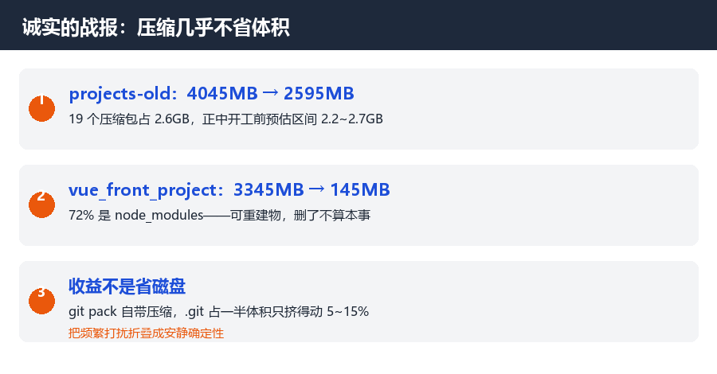

# 删掉 7GB 之后，回收站先背刺了我

> 摘要：两轮瘦身删了 7GB，本以为是简单的"压缩→删除"。结果对账时发现：回收站按先进先出悄悄淘汰了我 3.1GB 的原件，脚本还差点把"路径不存在"当成"删除成功"。这篇记录三个删除现场的坑，和一组诚实的数字。

上一篇讲了我给 33 个项目设计"退役终点站"：每个项目打成一个 7z，金标准校验（完整解压 + 逐文件 SHA256 比对）通过才允许删源。这篇是执行篇——删了两个工作区共 7GB，以及删除这个动作比我预想的脏得多。

## 01 先交战报：一组诚实的数字

projects-old：4045MB → 2595MB，其中 19 个压缩包占 2.6GB。vue_front_project 更夸张：3345MB → 145MB，因为它的 72% 是 node_modules。

这里要说一句反直觉的：**压缩归档几乎不省体积**。projects-old 里 .git 目录占了一半体积（2046MB），而 git 的 packfile 自带压缩，7z 只能再挤 5~15%。开工前我按内容类型分档估算：纯代码压到 6%~40%，含图的 40%~90%，最终 2.6GB 正好落在预估区间 2.2~2.7GB 里。

**归档的收益从来不是省磁盘，是把"散装的频繁打扰"折叠成"安静的确定性"。**省磁盘是顺手，不是目的。

## 02 回收站的先进先出背刺

正餐来了。全部删完后我做了一次对账——毕竟清空回收站是不可逆动作，删之前总得知道里面躺的是什么。

不查不知道：**我前一轮删掉的 3.1GB 原件，不在回收站里了。**

排查结论：回收站有容量配额（这台机器约 4GB）。我在 vue_front_project 删掉的 3.1GB 先进站；随后 projects-old 的 4GB 陆续入站，配额满了，回收站按**先进先出**把最早入站的 vuefront 件悄悄淘汰——没有提示、没有日志、没有任何交互。

这事最阴险的地方在于：**"进了回收站 = 安全"是错觉**。回收站不是备份，是一个有容量上限的延迟删除队列。如果我没有在清空前对账，我甚至不会知道有 3.1GB 的东西走过一遍"我以为的缓冲区"。

这次没造成损失，纯属运气好：**淘汰发生之前，每一项的归档已经做完**——7z 校验过的压缩包、git 镜像、提取出来的工具库。淘汰的只是"原件的最后一具遗体"。

由此得到本篇最重的铁律：**回收站的价值取决于你清空前做了什么，而不是它替你保留了什么。**正确的顺序是：归档 → 校验 → 删除 → 对账 → 清空。跳过任何一步，回收站都只是延迟的后悔。

## 03 守卫 bug：把"不存在"当成了"成功"

第二个坑是我自己写的。批量删除脚本里有个守卫函数，逻辑是：调用系统回收 API → 检查路径是否还存在 → 不存在就算成功。

它工作得很好，直到某次它报了"回收成功"，而我发现那条路径**从来就不存在过**——我拼错了工作区层级，把 `工作区/子目录A/xxx` 写成了 `工作区/xxx`。路径不存在，回收 API 报错，守卫一看"路径不在了"，判定成功，快乐继续。

幸亏随后的对账抓住了这个乌龙：那两个目录其实位于第三个目录里，后来被整目录归档进了压缩包——**最终没有丢任何东西，但流程上这是个事故姿势**。

修正后的铁律：**"删除成功"的证明分两步——先证明它曾经存在，再证明它现在不在。**只做后一半的守卫，会把"没找到"和"已删除"混为一谈。删除类脚本的日志里应该有每个目标的字节数和文件数，"删掉了一个不存在的东西"必须报错而不是报喜。

## 04 Windows 的脏细节：rc=120 和 rc=32

第三个坑来自系统层。批量回收某个目录时，Windows 的 Shell API 不讲道理地返回失败码——逐项排查后发现目录里每个文件都能单独回收，就是整个目录一起动会失败。

**根因是瞬时句柄**：杀毒软件刚扫描完刚入库的一批文件，句柄还没释放。解药两个，都笨但有效：**失败后等几秒重试一次**；还不行就**降级逐件回收**——把目录里的文件一个个来，最后收壳。

有意思的是这两个错误码在文档里语焉不详，社区里的答案清一色是"重试就好了"。Windows 桌面编程的很多坑就是这样：不是不会，是它没打算让你一次就对。

## 05 铁律清单

**回收站不是备份**——它是有配额的延迟删除队列，先进先出，静默淘汰。

**删除成功 = 曾经存在 + 现在不在**——只验证后一半的守卫是假的。

**金标准校验先行**——完整解压 + 逐文件 SHA256，全对才允许删源；移动归档后同样再对一遍。

**对账发生在清空前**——清空是不可逆的，对账是最后的止损窗口。

## 写在最后

这一轮删了 7GB，但真正让我后背发凉的不是任何一次删除动作，而是对账时那个发现——**我以为的缓冲区，一直在按它自己的规则悄悄丢东西**。

数据安全的全部要领，其实就一句话：任何"暂时放一下"的地方都不可信，唯一可信的是校验过的副本和它的数字签名。

---

**欢迎回到试验田，这是田里的第 5 个故事——7GB 删除战役，和一次及时的清空前对账。**

—— 试验田 · 第 5 篇 ——

*本文基于作者真实经历，脚本与校验均在真实环境执行，由 AI 辅助整理。*
