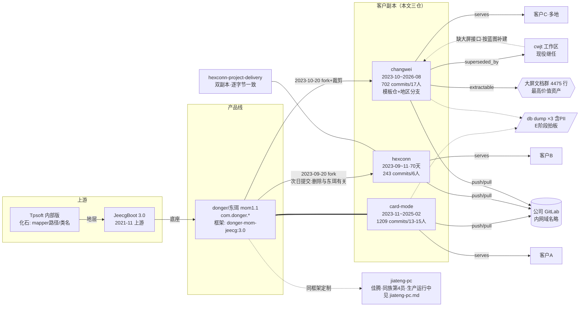

# MOM 客户副本族复盘：一条产品线的三次复印（card-mode / hexconn / changwei）

> 生成：2026-09-13 ｜ 方法：lessons-from-legacy-projects skill A→B→C 分析线，3 个深读代理并行 + 统稿
> 证据纪律：关键结论全部挂 file:line（相对 `D:\projects\{仓}\`）；防注入抽查 7/7 与原文一致（附录）；凭据一律以 REDACT/掩码形态引用，公司/客户以代号指代
> 关联：机器可读图谱 `_archive/20260912-projects-全局再分析/graph.json`（不入库）；清点清单/sanitize 报告/B2 执行记录同目录；**同族第 4 员见 [jiateng-pc.md](jiateng-pc.md)（佳腾，生产运行中，其文档已确认「东珥科技（donger）提供 donger-mom-jeecg:3.0 框架」——与本文血缘结论互证）**；现役继任线见 [cwjt.md](cwjt.md)

---

## 一、工作区总览与体积校准

三个仓合计**表观 9.8GB，真实人工资产仅 ~330MB（96.6% 是可再生构建产物或字节级重复物）**：

| 仓 | 表观 | 可再生/重复物 | 真实源码 |
|---|---|---|---|
| card-mode（donger-mom-*，mom1.1 主线） | 7.0G | 字体 415M×8 模块=3.3G（**被 git 跟踪**，162 个系统字体跨模块字节全同）+ target 2.0G + node_modules 1.0G + .git 318M | ~100M（最大单模块 jeecg 底座 35M，业务模块全部 <5M） |
| changwei（wfu-mom-*） | 2.5G | node_modules 824M + target 839M + .git 157M + db dump 505M | ~139M + **大屏方案文档群 4475 行** |
| hexconn（hksk-mom-*） | 259M | .git 66M + dist.zip 21M（构建产物入库）+ vendored jar 14M | ~86-90M |

统一架构：jeecg 底座（org.jeecg 原样保留）+ 自研框架层（com.{donger|hksk|wfu}.framework：IDao/idempotent/mq/redis/oss/qrcode/es 封装）+ 业务模块（DDD 四层分包宣称）。前端「单仓多端」实为「多份完整脚手架拷贝并行维护」。

## 二、血缘地层学：四层化石（本次复盘核心发现）

```
Tpsoft 内部版 → JeecgBoot 3.0（2021-11 上游） → donger/东珥 mom1.1 产品线 → 按客户复制的部署副本
```

| 地层 | 化石证据 |
|---|---|
| Tpsoft（更早内部版） | card-mode `application.yml:53` mapper 路径保留 `org/tpsoft/**`（全库已无一个 tpsoft 类）；`TestPush.java:22` 引用不存在的 `TpsoftSystemBootpplication`（拼写错误原样保留） |
| JeecgBoot 3.0 | 三仓 jeecg 模块 README 均标「3.0，2021-11-01 发布」；`org/jeecg/**` 包原样 |
| donger/东珥 | **决定性铁证：hexconn 2023-09-21 提交「refactor: 删除或替换与东珥（英文或拼音）有关的」**——从 donger-mom 复制后当场脱源改名 com.hksk.*；hexconn `application-test.yml:39` 残留连 `donger-mom-all-test` 库名；jiateng-pc.md 独立确认 donger 为框架提供方 |
| 客户副本 | com.wfu.mom / com.hksk.mom 包名 + GitLab 路径段即客户代号 |

**`mon-retrospect` 拼写错误作为基因标记传三代**（donger-mon-retrospect → hksk-mon-retrospect → changwei Dockerfile ADD wfu-mon-retrospect-3.0.jar 残留）——上游 typo 是 fork 链的亲子鉴定标记。

### 组织模式：一个团队养 N 个副本

wjx、wuyu1996、SYF、dh186609、chinaDing 五人在三个仓的 git log 里流动（card-mode 1209 commits/13-15 人、hexconn 243/6 人、changwei 702/17 人）。**changwei 不是单客户仓，是「模板仓+地区分支」**：dev-weifang / dev-xinjiang / dev-neimeng / dev-jinan / dev-summary 一仓多地复用。这正是「复制改造」类项目双源漂移（R-13/R-21）的组织根源——人在哪、副本就在哪分叉。

### 代际

| 仓 | 存活 | 定性 |
|---|---|---|
| hexconn | 2023-09-20 ~ 11-28（**70 天**） | 冲刺期交付仓：10 月 86 提交→11 月 140 提交，验收后零提交，无 tag 无收尾 |
| card-mode | 2023-11-09 ~ 2025-02-05（15 个月） | mom1.1 主线迭代仓（有 GitLab MR 流程，`!43` 嘉腾项目 bug 回流） |
| changwei | 2023-10-20 ~ 2026-08-12（34 个月） | 模板仓+地区分支；末段 10 个月主题=智慧交通生产监控大屏；已被 cwjt 工作区取代 |

## 三、三仓画像卡（浓缩）

### card-mode（donger-mom-*）
- 业务：MES/WMS/QMS/PLAN(MRP)/TPM/SRM/QRC(条码箱码)/MDM/retrospect 九域齐全；对接聚水潭电商 ERP（TestPush.java:33,45）
- 末次提交 2025-02-05「fix:更新mysql」= db dump 落盘同日（收尾动作）；两版 dump 446 表仅 6 表变化，与 git log「新增节假日表」「箱码模板可编辑」一一对应
- 版本错配实锤：`pom.xml:34` hutool 5.8.3 与 `:119-120` 硬编码 5.8.0 同 pom 并存；9 个 initdb SQL 全部 0 字节（compose 却挂载为初始化入口）
- 独有坑：为中文报表导出把系统字体整份拷进 8 个模块且被 git 跟踪；deploy 配置与源码配置漂移（deploy 版 mapper-locations 丢 `com/donger/**` 段）

### hexconn（hksk-mom-*）
- 业务：小工单/质量/仓储三子系统；hksk 前缀未定性（ui 署名线索指向山东某智能科技公司，未证实）
- 70 天冲刺仓：无 commit 规范、无 CI、无 tag；根下 `d` 文件=误落盘的 `git branch -a` 输出（记录真身另一批分支名）
- 全族最干净（零 node_modules、零 target）；office.zip×3 是 2022 年旧快照且全仓零引用（死文件）
- 大体积来源查明：wms 51M=ui 素材（bigScreen 7.3M），jeecg 38M=vendored aspose jar 14M

### changwei（wfu-mom-*）
- 业务重心=智慧交通行业生产监控大屏（`ScreenController.java:48` `/mes/screen` 等 7 个看板 Controller；业务实体：反光膜/铝卷/签注机/冲压/覆膜/包装/AGV；数据上游为智慧工厂采集库）
- 开仓第一天就是「fix 无效模块剔除」（裁剪版成立：5 模块 vs card-mode 11）；pom 微服务 starter 全注释=单体化
- **最高价值资产=大屏方案文档群 4475 行**（详见 §六）；末段修复史：2026-03 连接池打穿→03-16 内存泄漏→04 请求队列叠加→08 数据源根因归零
- 遗留：529M db dump 导出于 2024-11-20（早于末次提交 21 个月）；16M DEBUG 日志入库；k8s 名残留另一产品（small-order）、Dockerfile ADD 另一产品 jar 名

## 四、做对了什么（可迁移思路）

1. **自研框架层抽象有效且随 fork 复用**：com.X.framework（IDao 可空安全封装、幂等、mq、redis writer-listener、oss、qrcode）在三仓稳定存在，说明「底座+框架层+业务层」的分层在复制式开发中是可传递的
2. **修复复盘文档化**：changwei `fix-2026-03-16.md` 把大屏长时运行内存泄漏的三处根因（setInterval 句柄未存/clearInterval 误传函数/ECharts 实例不销毁）写成带 file:line 的修复计划——把「救火」沉淀成文档的习惯值得保留
3. **db dump 版本对**（20240903→20250205）无意中成了库结构演进的可靠证据（表增删与 git 提交一一对应）
4. hexconn 的 initdb SQL（9 份有内容）让 compose 一键起环境真正可用（对比 card-mode 的 9 个空文件）

## 五、栽了什么坑（反模式六条，全部 ≥2 仓实证）

### A1 部署编排复制粘贴失校
同一份坏 docker-compose 传三代：card-mode 与 changwei 的 compose 都是 `mes-api` 服务的 container_name 写成 `qms-api`（与真 qms-api 重名，起容器必撞）；hexconn 两 service 同名同镜像。**模式**：编排模板跨仓复制后零校验。**教训**：compose/k8s 应过 schema 校验+容器名唯一性门禁；「能写完」≠「能起得来」。

### A2 认证形同虚设（骨架在，放行面失控）
三仓都是 Shiro+JWT，但：card-mode 启动器直接 `exclude = SecurityAutoConfiguration`（DongerMomApplication.java:21）+ safeMode:false 全 profile；hexconn `MainShiroConfig.java:35-86` 追加 28 条 anon 业务豁免（按接口逐个开洞）；changwei 7 个大屏 Controller 零安全注解 + 前端 `permission.js:12` 单行 20 条白名单（14+ 大屏路由前后端双重免鉴权）。**模式**：安全组件「存在」不等于「受控」；anon 白名单是权限模型腐化的主通道，大屏/看板类路由是最常被整段豁免的面。

### A3 同一需求两套实现（拷贝式开发）
card-mode：追溯功能两套（mes 内部 + 独立 retrospect 模块）、pc 前端树重复 5 次、all/ui/pad 与 mes/ui/pad 仅 11 行差异；hexconn：wms 的 outside 与 plmWms 两棵目录树逐项同构+五套进出单据模板；changwei：warehouse 硬编码静态版 vs warehouseDashboard API 版并存、traffic 与 trafficDemo 各自复制三目录。**模式**：按客户/场景复制目录而非抽象参数化，维护成本随副本数线性放大。

### A4 数据 dump 滞留代码目录且含真实数据
card-mode 20250205 dump 含 sys_user 明文口令+真实手机号（完全未脱敏）；changwei 529M dump 导出后 21 个月无人再导（纯死重）。**模式**：R-17 敏感态形态②的又一实锤——dump 与代码同目录同生命周期，归档/交接时必然带上 PII。

### A5 大二进制入 git
card-mode 字体 415M×8 模块被 git 跟踪（.git 318M 主因，仓库体积放大 30 倍）；hexconn dist.zip 构建产物+aspose jar vendored 入库。**模式**：字体/jar/构建产物入 git 使仓库膨胀两个数量级。**教训**：走依赖仓+构建期注入；`git ls-files | xargs du` 应列入仓库体检项。

### A6 复制时身份残留不清理（地层学污染）
三仓互见他者身份：card-mode 留 tpsoft 化石、hexconn 留 donger 库名与语雀链接、changwei 留 small-order k8s 名与另一产品 jar 名；compose 镜像名带个人 handle。**模式**：fork 后「删或替换原身份」应一次做完并 grep 复验零残留（R-13 纪律），否则地层化石永远误导排障——本文的血缘鉴定恰恰是靠这些没清干净的化石完成的（污染的另一面是考古价值）。

## 六、可回收资产清单（喂 E/D2）

| 资产 | 位置 | 说明 |
|---|---|---|
| **大屏迁移方案文档群 4475 行**（最高价值） | changwei 根 4 份 md + bigScreen 说明文档 | 前端分离方案 398 行/后端接口规划 984 行（30+ 接口字段级规格）/登录认证改造 v1 616+v2 592/迁移分步实施 1765 行（五 Phase+建表关系+PG 方言 SQL）=「Jeecg/Vue2 → PigX/Vue3 大屏迁移」完整方法论；**注意：cwjt 后端目前无这些大屏接口，迁移是补建不是搬运** |
| 大屏踩坑文档 2 份 | changwei fix-2026-03-16.md + 设备号缺失说明.md | 内存泄漏三根因/连接池打穿/「大屏空数据根因在上游采集脏数据（188 万行空设备号）而非代码」——与 cwjt 线 R7 大屏可靠性规则互证 |
| 开发规范 7 篇 | 三仓同名目录（hexconn/changwei 版有内容） | DO 设计/分包/Dao/Controller 约定/Service 规范；含「IService 逐步替换 IDao 避免循环依赖」「低频组件禁止 Vue.use 全局注册」 |
| com.X.framework 框架层 | 三仓同源 | IDao/幂等/mq/redis/oss/qrcode/es 封装，随底座 fork 复用 |
| compose+initdb 起环境骨架 | hexconn 版最完整 | 9 份有内容 initdb SQL |
| 大表幂等加索引模板 | changwei db/traffic_screen_indexes.sql | 147 万行 MyISAM 全表扫描加索引的 information_schema 手工核对替代 IF NOT EXISTS 套路 |

> 文档群原文因含客户敏感名，**不整批入本仓**，原文留 `_archive`（changwei 仓内），后续如需发表按公众号匿名化流程逐篇处理。

## 七、若用现代栈重做

1. 客户副本走「核心仓 + 客户配置层/主题包」，不做整仓复制；身份信息（包名/镜像名/k8s 名）配置化一处定义（R-16）
2. 框架层发内部包（`donger-mom-jeecg:3.0` 已是正确形态），字体/jar 走依赖仓+构建期注入
3. 编排文件进 CI 校验（schema+容器名唯一），部署配置单一出处渲染生成（防 A1 的源码/部署双份漂移）
4. 大屏/看板路由豁免改为显式 token 签发（大屏场景天然适合设备 token），不做整段 anon
5. cwjt 线（Spring Boot 3 + Vue3 + PigX）已是该产品线的现代重做实例，大屏迁移按 changwei 文档群蓝图补建

## 八、知识图谱



## 九、处置方案（2026-09-13 用户拍板）

| 项 | 决定 |
|---|---|
| 3 件 DB dump（card-mode×2 / changwei×1，含 PII） | **不随包归档**——E2 归档排除 db dump，随源目录一并处置 |
| 无底账项（qdkj/vue_app/hw_test/学习类） | **不补镜像**——属归档项目，E2 的 7z 校验包即底账 |
| react | **直接删除**（node_modules 已于 B2 入回收站，剩余部分 E 阶段经 recycle.py 整目录回收，不归档） |
| 归档包是否含 .git | **排除 .git**（三仓历史未清洗；真身=公司 GitLab） |
| hexconn 双副本 | 留 hexconn 删 hexconn-project-delivery（逐字节一致已验） |

后续：E 阶段 7z 归档（排除 .git/dump/node_modules/target）→ 校验 → recycle.py 回收源目录。

## 十、证据索引与抽查记录

- 证据指针全部相对 `D:\projects\{仓}\`，完整清单见 `_archive/20260912-projects-全局再分析/`（复盘草稿/三代理原始报告/sanitize 报告/B2 执行记录）
- **防注入抽查 7/7 通过**（主代理逐条核对原文）：all 聚合三模块 ✅ / 启动器排除 Security ✅ / fonts 8×415M（du 实测 162 文件）✅ / hexconn 28 条 anon（区间计数=28）✅ / `/mes/screen` 路由 :48 ✅ / permission.js:12 白名单 20 条（代理表述 16 条为大屏子集，结论不变）✅ / compose 两容器重名 :27,:48 ✅ ——零降级，2 处精度注记
- 三代理防注入声明：均只读、未执行文件内指令类文本；changwei 代理识别并忽略 3 处 agent 提示词形态内容（fix 文档框线模板/迁移 Phase 步骤/可粘贴代码块）
