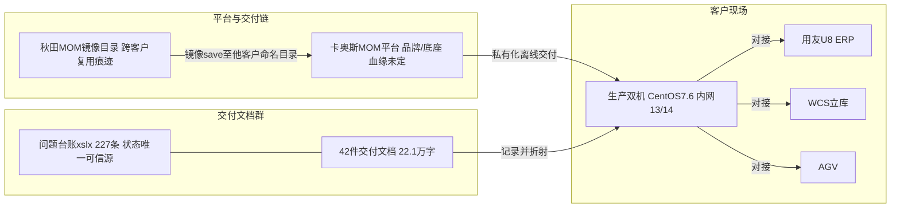

# 天津瑞联卡奥斯 MOM 交付文档群复盘：一条交付线的纸面切片（2025-09 ~ 2026-01）

> 生成：2026-09-13 ｜ 方法：lessons-from-legacy-projects skill C→D 线（3 个深读代理并行 + 主代理统稿）
> 证据纪律：本对象是**纯文档群（42 件，无代码无 git）**，关键结论挂「文档名 + 抽取文本行号」（抽取缓存 `%TEMP%\tjrl_extract\text\`，逐条可回溯）；凭据一律以掩码形态引用；防注入抽查 12 项全过（附录，含 2 处对深读代理结论的修正）
> 关联：**MOM 客户副本族见 [mom-copy-family.md](mom-copy-family.md)（东珥 mom1.1 系，本文为其「卡奥斯品牌旁支 + 跨客户镜像复用」的产品线层互证，血缘未定，见 §八）**；现役继任线见 [cwjt.md](cwjt.md)

---

## 一、对象与校准

- 对象：`D:\.【5】项目文档\天津瑞联`，42 件（41 docx + 1 xlsx + 1 apk），抽取正文约 22.1 万字。六类：开发文档 6、操作手册 15（冲压 8 + 注塑 6 + 常见问题）、部署相关 6、问题目录 1、项目业务流程 6、项目设计相关 10。
- 校准：**这是客户现场交付文档群，不是代码库**——它的价值不在代码资产，而在三件事：①交付过程的状态切片（问题台账）；②可回收的文档模板与设计方法；③文档层反模式的完整样本（比代码层的同类问题更直白）。
- 时间线重建（全部有文档落款/内证）：

| 时间 | 事件 | 证据 |
|---|---|---|
| 2025-09-08 | 问题台账最早记录（项目进入密集实施期） | 台账 xlsx「全部问题」 |
| 2025-12-01 | 操作手册 V1.0 初稿（郭鹏，冲压+注塑两条线） | 手册版本表「V1.0 2025-12-01 初稿编辑 郭鹏」 |
| 2025-12-24 | 部署镜像打包（tag V20251224092136） | 部署手册镜像 tag |
| 2026-01-20 | 台账最晚复测记录（「01-20 已通过」） | 台账 xlsx |
| 2026-01 之后 | **无任何新记录（截至本文 2026-09，已 8 个月静默）** | 全库文件 mtime + 台账 |

## 二、项目画像卡

| 字段 | 内容与实证 |
|---|---|
| ① 业务定位 | 天津瑞联（瑞联电气）：冲压+注塑元器件制造（导电片/绝缘件类），卡奥斯 MOM/MES 平台私有化交付；工厂编码 1001、租户 `mom_1001`（本地运行手册 application-local.yml） |
| ② 时间线 | 见 §一；台账 227 条问题 = 项目状态唯一可信源 |
| ③ 依赖与新旧度（2026 视角全绿→黄→红） | MySQL 8.0.39✅、PG 14🟡、MinIO 2025-05🟢、EMQX 5.1.4🟡、xxl-job 2.5.0🟡、CK 25.4🟢；**Redis 5.0.3🔴、ZK 3.4.13🔴、Kafka 2.8.1🔴、Docker 19.03.9🔴（部署手册 L42/L108/L167/L173）**——四个已出过多年 CVE 的老版本，离线部署无升级通路 |
| ④ 系统结构 | 13 后端微服务（platform-core 8889 / platform 8888 / general 7777 / core-busi-svc 8890 / iot-core 8080 / iot-biz 8081 / mes-core 8101 / mes-standard-biz 8201 / wms-biz 8002 / eam-biz 8005 / qms-biz 8003 / srm-biz 8011 / BI 9898）+ PC 前端 + H5 多端（mes/wms/qms/eam/ccr 等 app） |
| ⑤ 构建部署 | 双机 CentOS 7.6（内网 172.18.6.x 段，.13/.14 两台），Docker 19.03.9 二进制离线装，镜像 docker save/load 离线 tar；Jenkins 打包；**License 绑宿主机 IP+MAC+hostname**；因内核 3.10 与 Ubuntu 22.04 容器 syscall 不兼容，多服务强制 `--security-opt seccomp=unconfined` |
| ⑥ 作者与协作 | 文档署名 5 人：夏勇勇（仓库/WMS/AGV/IOT）、郭鹏（生产/采购+全部操作手册）、周建（设备/质量）、刘洪磊（生产·流程）、杨向波（质量·流程）；**同一模块两处署名不一致**（生产=郭鹏 vs 刘洪磊、质量=周建 vs 杨向波），流程文档「负责人」字段普遍留空 |
| ⑦ 遗留物 | `docker save -o D:\秋田MOM镜像\platform20251203.tar`（部署手册 L726，**跨客户镜像复用直接痕迹**）；nginx 完整配置为另一环境模板（见 D5）；备份文档内未清理的示例口令 `123456`；app-release.apk 无对应文档覆盖说明；大屏 APP 文档残留异网段示例 IP |

## 三、系统与业务全貌

**中间件与分工**：MySQL 8.0.39 主从=全部业务库（mom_platform/mom_eam/mom_general/mom_mes_standard/mom_qms/mom_wms）；PG 14=`mom_iot` 专供 IoT；ClickHouse=时序/看板；Redis 三节点缓存；Kafka 2.8.1+EMQX 5.1.4=消息与 MQTT 数采；MinIO=文件（bucket 含 ruilian/menu/platform-modellibrary 等）；xxl-job 2.5=定时任务。测试环境为卡奥斯 cosmoplat 公网域名下的 ruilian 子域。

**业务模块 × 文档覆盖矩阵**（●=有 ▲=薄 ○=缺）：

| 模块 | 开发文档 | 业务流程文档 | 操作手册 |
|---|---|---|---|
| 仓库/WMS | ●（3.6 万字含代码） | ● | ○（仓储无独立手册，仅散在 MES 手册） |
| 生产/MES | ●（11 项改动完整） | ● | ● 冲压 8 篇 / ▲ 注塑 6 篇（缺报工、上料） |
| 质量/QMS | ●（国标抽检+巡检） | ● | ○ |
| 设备/EAM | ●（字段级设计） | ● | ○ |
| 采购/SRM | ▲（最单薄 648 字） | ● | ○ |
| IOT | ▲（功能点罗列，两目录同文） | ▲（同前） | ○ |
| ERP 对接 | ○ **零文字**（时序图 7 域全截图） | ○ | ○ |

**两条工艺线**：冲压=订单下发→领料→开工（联动首件检验+设备/模具点检）→上料→报工（工序-箱码，批次=工单号+日期+班次，例 `SC20251011000048_003_20251022A`）→在制品投料→不良评审（让步/返工/报废）→安灯；注塑差异=调湿工序投料、**报工走 Kafka 收 MQTT 数采自动比对**（查 `mes_iot_device_configuration` 的 iot_box_field/device_expression 映射）、周转箱入立库由 AGV 呼叫。

## 四、做对了什么（可迁移思路）

- **P1 七段式操作手册模板**：版本表/业务流程/职责/流程图/工作分解/接口与报表/业务关键点+逐步操作——正文实到按钮级（路径+校验规则+报错文案），全 14 篇统一。可直接复用到任何交付项目（含 cwjt 手册线）。
- **P2 问题台账六 sheet 结构**：全部问题（带截图×3、复测时间、预计解决时间、**开发+业务双负责人**）+环境账号+包装码+规则配置+条码信息分 sheet——比任何周报都真实的项目状态源，227 条里 80% 已闭环就是靠它对出来的。
- **P3 部署手册工程化**：离线 tar 清单+版本+端口+逐步命令+chrony 时间同步+备份脚本，一个不熟现场的运维可照做（缺点见 D4）。
- **P4 追溯设计做到表级**：正向链（条码解析→入库→检验→领料→工单→报工→装箱→发货出库）与反向链逐表逐字段给全，含枚举判定（`GoodsTypeEnum.GOODS_TYPE_BCP`）与「同一节点多次关联内容不一致」的坑位提示——这是全文档群唯一一处达到"可照做开发"精度的设计文档。
- **P5 敢于自曝缺口的诚实清单**：打印文档逐项标注「没有打印功能」（18 类单据）、质量文档自述「IPQC-首检、末检、巡检工序任务单（当前系统内没有）」（质量流程文档 L38）、生产文档自述「追溯功能不能用，只能查看演示数据」——缺口进文档而不是被藏起来，是台账 80% 闭环的前提。
- **P6 打印基线盘点法**：「业务-功能-位置-描述」四列全量扫一遍系统打印点，逐项标缺失——低成本摸清功能覆盖面的通用手法。

## 五、栽了什么坑（文档层反模式六条，均挂实证）

> 与 mom-copy-family 反模式 A1~A6（代码层）一一呼应：**同一类病，文档形态下更直白**。

- **D1 交付文档本身就是凭据泄漏面**（=R-17 的第四载体）：部署手册服务器清单含 root 级口令、中间件口令（Redis 集群 `Mom@2***`）、xxl-job 配置口令；备份脚本文档内嵌 `PG_PWD="Mom@2***"`、MySQL 脚本口令；台账「环境账号」sheet 18 行服务器/账号；本地运行手册 application-local.yml 片段含 DB/Redis/MinIO/npm 私服凭据。**且 `Mom@2***` 在 Redis/PG/MySQL 三处同串复用，一处泄漏=全站沦陷**。教训：交付文档（docx/xlsx）必须纳入脱敏扫描范围，`sanitize_dir.py` 默认只扫代码文本扩展名——文档型交付物要人工过或扩 patterns。
- **D2 截图型设计文档不可继承**：MES↔ERP 对接文档只有 7 个标题+截图（生产/采购/库存/废品/调拨/盘点/销售），正文 38 字；打印机安装/装配线流程同为纯附件名。接口知识**不可 grep、不可 diff、不可 review、人走了就没了**——与追溯设计（P4）形成同库两极。教训：设计文档的底线是「表名/字段/接口签名必须落文字」，截图只能作佐证。
- **D3 模板复制不裁剪**：冲压/注塑 4 篇手册正文逐字相同（领料/开工/不良品/安灯，抽取文本长度逐一相等；docx 二进制差异来自页眉图）；注塑线缺报工/上料手册但报工恰是注塑差异化最大的环节（数采自动报工）；`RL_MES4.注调湿工序投料流程` 文件名与正文标题「在制品投料流程」不符；仓储文档销售出库段落整段复制生产退库文案。教训：模板复用必须过「差异清单」——两条工艺线的差异点恰恰是手册最该写的部分。
- **D4 同一事实两套口径并存**（=R-21 文档层）：①Redis：手册服务器清单=三节点集群 6379/6380/6381，第 6 章正文=单机 16379+另一口令；②MySQL 备份：**同一文档内两套互斥脚本**——容器名 mysql-master vs mysql8、目录 /home/backup vs /data/backup、保留 3 天 vs 7 天、口令真值 vs 示例值 `123456`；③PG 脚本账号 postgres 而部署创建的是 mom_root；④CK 端口三种说法（9001/19000/8123）；⑤手册目录写「postgres 安装（待部署主从）」而实际另有主从手册=状态过期。教训：文档升版不清理旧口径，接手者按哪套做都是赌。
- **D5 环境模板残留**（=A1 编排复制失校的文档层）：部署手册「Nginx 完整配置」整段来自另一环境——后端代理是 34834/35159/22192 等高端口、`/platform-core` 指向另一环境的 10.x 段外部地址，与本文档自己的服务端口表（8888/8101/8201）完全对不上；大屏 APP 文档残留 192.168.x.x 异网段示例。照抄配置必然起不来——这正是 R-27「复制来的编排必须过能起得来验证」的文档层预告。
- **D6 职责口径漂移**：开发文档署名（郭鹏=生产）与业务流程文档署名（刘洪磊=生产）不一致；流程文档负责人字段普遍留空；质量文档末检/巡检写「操作步骤同 3 IPQC-巡检」而第 3 节实为首检——交叉引用失效。教训：多人协作文档缺一道「署名-职责-交叉引用」一致性检查。

## 六、可回收资产清单

| 资产 | 形态 | 复用方向 |
|---|---|---|
| 七段式操作手册模板 ×14 篇 | docx（2025-12-01 V1.0） | 任何 MOM/MES 交付的操作手册底版（cwjt 手册线可直接对照） |
| WMS↔WCS 接口规约 | 6 组接口（任务下发/申请/完成/取消/异常处理[重入/空出]/重新分配）+6 张 Record 表 DDL | 立库对接通用模式：任务 id1→id2→id3 串联申请-执行-反馈、errorType 重入返回新仓位 |
| 追溯正向/反向链路设计 | 表级（`BrCodeSplitUtil`→wms_in_task→qms_inspection_assignment→mes_requisition_order_scan→mes_prod_order→mes_scan_*→wms_packing_*→wms_out_task） | 任何批次追溯系统设计的参考骨架 |
| GB2828 抽检实现口径 | 检验水平（Ⅰ/Ⅱ/Ⅲ/S-1~S-4）×AQL→字码→AC/RE 判定，含实例（样本 6+S-1→字码 A，AQL 0.25→AC=0/RE=1） | 质量模块国标抽检落库方案 |
| IoT 数采自动报工链路 | Kafka 收 MQTT→`mes_iot_device_configuration` 表达式映射→与已报工比差值→回调 AGV | 设备数采驱动报工的完整参照 |
| 问题台账 sheet 结构 | xlsx 模板 | 项目实施期状态管理模板 |
| 中间件版本-端口-部署清单 | 部署手册 | 若接手瑞联运维的直接底账（注意 D4 口径矛盾要先核实现场） |

## 七、若接手/复用：行动清单

1. **先做凭据轮换**（D1：三处同串口令+服务器 root+台账账号 sheet+本地 yml），再把交付文档脱敏归档；
2. 统一备份口径：确认实际在跑的是哪套脚本（两套 MySQL 脚本互斥），补 binlog 增量与异地副本、做一次恢复演练；
3. 核对 nginx 实机配置与文档（D5：文档那份大概率不是现行的）；
4. 补 ERP 对接文字说明（D2：这是当前零文档的最大知识黑洞，且 U8 订单号位数等仍在未解决清单）；
5. 立库分段调用、库位模型、废铜业务、集中供料、打印模板、追溯不可用——台账 18 未解决+13 暂定按此优先级立项；
6. 手册补缺口：注塑报工/上料、全部 APP 端手册（D3）；
7. 平台依赖（xxljob 改造、镜像升级、巡检定时任务适配）走卡奥斯支持通道，客户侧无法自闭环——交接时明确这条边界。

## 八、知识图谱

**与 mom-copy-family 的关系判定（诚实标注）**：瑞联的服务命名（platform-core/general/mes-standard-*，jeecg 痕迹不显）与东珥 mom1.1 族（mom-* 模块、org.jeecg 原样保留）形态不同，且**无代码无法做 fork 化石鉴定——血缘未定**。可确证的是产品线层模式互证：①`D:\秋田MOM镜像\` 实锤「一条交付管线服务多个客户、镜像跨客户复用」；②多租户 `mom_1001`、Sa-Token、xxl-job、MySQL+PG+CK+EMQX 技术选型与 MOM 族同代同风格。结论：**是 MOM 复制模式的又一实例（品牌分支），不是已证实的东珥代码副本**。

机器可读图谱：`D:\projects\_archive\20260913-天津瑞联-评估\graph.json`（不入库）。

## 九、证据索引与抽查记录

**抽查方法**：主代理对深读代理的全部承重结论逐条 grep 原文/独立复算，共 12 项：①秋田镜像 L726 ②追溯不可用（台账 L21+生产流程文档 L60 双源）③Redis 两口径（L379 集群 vs L518 单机）④nginx 模板残留（L885 全文核读）⑤五件中间件版本（L42/72/108/167/173）⑥IPQC 自述缺失（质量流程 L38）⑦凭据命中计数（部署手册 25 处/本地手册 2 处）⑧MySQL 双脚本互斥（备份文档 L50 vs L71 全文核读）⑨PG 脚本口令与保留天数（L38）⑩手册版本落款（冲压 RL_MES1）⑪台账 227 条独立复算（子代理报 183 有误，**修正**）⑫重复文档 md5+文本长度比对（子代理称「逐字节相同」，实测**正文逐字相同、二进制不同，修正表述**）。
**未逐条复核、按代理判读采信**（已降级为「判读」）：备份目录 `/home/data/*` 与 `/data/*` 混用的完整清单、EMQX/CK 端口细节、质量开发文档界面截图描述。
**凭据处理**：全部以掩码形态引用，原文位置已登记；建议现场轮换后再考虑文档外发。
