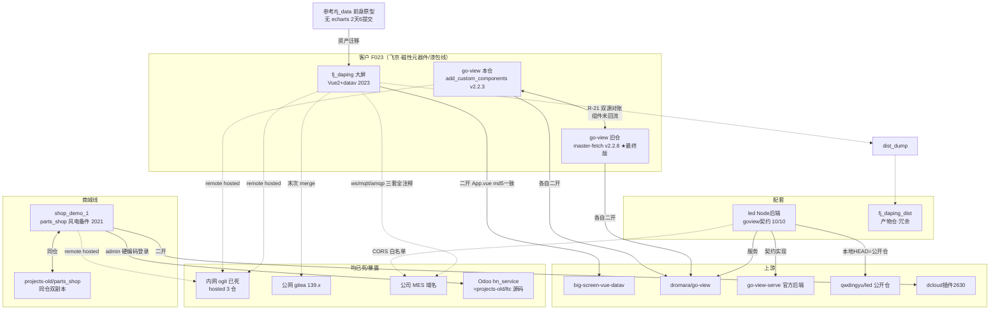

# vue_front_project 复盘：前端项目群画像、技术深读与知识图谱

> 生成：2026-09-07 ｜ 方法：lessons-from-legacy-projects skill A→B→C→D 分析线，3 个深读代理并行 + 统稿
> 证据纪律：关键结论全部挂 file:line（相对 `D:\projects\vue_front_project\`）；防注入抽查 6/6 与原文一致（见附录）；敏感值已脱敏（公司域名/IP 末段/口令/邮箱）
> 关联：知识图谱机器可读版 `_archive/20260907-vue_front_project-评估/graph.json`（不入库）；清点清单与 sanitize 报告同目录

---

## 一、工作区总览

**3.3GB / 22 个顶层条目 / 11 个 git 仓**，其中 node_modules 2.4GB（72%）、第三方参考仓 1.0GB——真实自研源码不足 100MB。核心资产是同一家公司数字化业务（客户代号 F023）的三件套：**fj_daping**（产线 MES 大屏）、**go-view 双副本**（大屏低代码编辑器，remote 名 lowcode_daping_front）、**led**（其 Node 后端），外加 2021 年的 **shop_demo_1**（风电备件商城，与 projects-old/parts_shop 同仓）。

一个容易被忽略的事实：多数目录 mtime 集中在 **2022-12-05**——这是工作区的「装箱日」，即该目录本身是一次搬家产物，此后 2023 年的新项目（fj_daping/go-view/led）直接产在了搬家后的箱子里。

分层画像：

| 层 | 内容 | 判定 |
|---|---|---|
| A 核心 | fj_daping / go-view(本仓+旧仓) / led / shop_demo_1 | 复盘主体，git 历史全保留（用户已拍板） |
| A 冗余 | fj_daping_dist（91M 产物仓）/ led.zip / fj_daping/node_modules.zip | 可回收，删前 diff |
| B 参考 | 参考/ 六仓（2023-04 集中 clone 的选型调研）+ vue/rh-admin | 上游副本，压缩归档即可 |
| C/D demo | shop_demo ×2 / app_demo ×10 件套 / app1 / vue_echarts | 学习件 |
| E 错放 | AI_CITY(Django) / gui_demo(Python GUI) / rpa_UI_demo(Qt) / 根下 cevt.conf(Odoo10 配置) | 非前端，属别的时代 |
| F 杂烩 | win32_demo（882M，99% 依赖，**无 git**） | 脱敏与备份双盲区，数据文件待人工过目 |

## 二、项目画像卡

### 2.1 fj_daping —— 五天拼装的 F023 大屏交付

| 维度 | 事实 |
|---|---|
| 业务 | 磁性元器件智慧工厂 4 屏大屏（综合看板/设备监控/车间监控/dashboard 备用页），1920×1080 固定设计稿 |
| 出生 | 2023-04-17 `init` 一次带入全部结构（非渐进开发，是成型代码导入）；4-17~21 一天 8 commit 的像素级冲刺；**空窗 4 个月**；2023-09-11 验收前抢救 2 提交，末次提交即一次跨两套 git 服务的 merge |
| 作者 | 单人（F023），18 commits，无协作者无评审 |
| 依赖 | Vue2.6+echarts4.6+datav2.7（上游同源）+ 新增 axios/mockjs/mqtt/stompjs×2/amqplib；2026 视角全链路陈旧（Vue2 EOL、echarts 落后 3 个大版本） |
| 结构 | views 65 文件（4 业务页+origin 冻结版+index-back 备份页）、api/mock/config/lib 四目录全新增、components 四个自研组件 |
| 构建 | vue.config.js 仅 10 行：`publicPath:'./'`，**无 productionSourceMap:false** → dist 15M 中 9.3M 是 .js.map（交付包携带全部源码映射）；引用 `VUE_APP_URL_ENV` 但仓库无任何 .env 文件 |
| 遗留 | 1 处未提交改动（`views/index/centerRight1.vue` 接接口的半成品，方法体为空）——**这是它生命周期的最后一下** |

**一句话**：上游模板骨架（App.vue 逐字节相同）+ 前身 fj_data 的页面资产 + 四个全新增目录，5 天拼装、4 个月搁置、验收前抢救的交付物。

### 2.2 go-view —— 一个项目、两个副本、一次判定

| 维度 | 本仓（add_custom_components） | 旧仓 D:\projects\go-view（master-fetch，已有复盘） |
|---|---|---|
| 版本/末次 | v2.2.3 / 2023-09-26 | v2.2.8 / **2024-07-01** |
| 提交数 | 9（master 3 + 分支 6） | 多年演进 |
| 独有 | AnyCarousel、TableScrollBoardColorText 两个组件 | BarLine、TablesBasic、Inputs 系列、FlowChart 等 5+ 组件与 drag/keyboard 拆分 |
| 缺失 | 已复盘版全部 bugfix（isCustomElement、reportCompressedSize、取数 else 分支） | 本仓 2 组件（双向 diff 确认未回流） |
| remote | 内网 ogit 的 F023/lowcode_daping_front（**remote 名被改成 master**，必死单点） | 个人 hoitok 仓 + gitee fork |

**对账判定（R-21）**：**旧仓 master-fetch 是功能最终版**（晚 9 个月、版本更高、修复更全）；本仓价值=2 个独有组件。复活路线：旧仓为主干，移植本仓 `Informations/Mores/AnyCarousel/` 与 `Tables/Tables/TableScrollBoardColorText/` 两个目录 + 各自分类 `index.ts` 注册行；**不要反向**。唯一变数：内网 lowcode_daping_front 若还活着可能藏有更多分支，复活前先试 fetch。

**本仓增量技术要点**（不重复已复盘 16 条踩坑）：
- 自定义组件完全复用开源「5 件套」注册体系（`src/packages/index.ts:9-17` 的 import.meta.glob 扫描），无旁路——体系扩展性得到再次验证
- **AnyCarousel 是「能拖进面板的 mockup」**：config.vue 能完整编辑 11 个属性（`AnyCarousel/config.vue:2-72`），但 index.vue 的 dataset 渲染被整段注释、换成三页硬编码设备卡片（`AnyCarousel/index.vue:6-15,41-255`）——末次提交「增加视图」就是把 2 张卡片扩成 6 张 3 页轮播
- 编辑态永不取数：`src/hooks/useChartDataFetch.hook.ts:116` 的 `if (isPreview())` 门——编辑器内自定义组件拿不到数据（旧仓同文件 :127 已补 else，本仓未同步）
- 登录链路是坏的：`src/api/axios.ts:38` token 注入被注释，`:39` 换成了在请求头里写 `Access-Control-Allow-Origin`（响应头，浏览器请求中无意义）
- `src/api/http.ts:218` 把请求头 JSON 打进前端 console——一旦恢复 token 注入就是凭据泄露通道

### 2.3 led —— 有签不验的 go-view 后端

| 维度 | 事实 |
|---|---|
| 出身 | **原创开源项目，非 fork**：27 commits 全部作者 qwdingyu（2023-02-02→04-27，11 周），首提交只有 75 行 README；本地 local_dev 与公开仓 HEAD 同哈希，是个干净 clone；本地增量全在未提交工作树（114 处：CORS 加 4 个生产源、DB 口令、cross-env、上传残留） |
| 血缘 | 作者 iMES/SMT 平台：库名 iMES、`pf_*` 表前缀、示例 SQL 查产线工位表 bm_ipinfo |
| 架构 | express 三层（routers→controllers→services）+ sequelize 模型 + knex 动态 SQL 网关；mysql/mssql 双库经 NODE_ENV 切 dialect（`config/index.js:14`），存储过程前缀 call/exec 按库切换（`dbHelper.js:44-59`） |
| 契约 | go-view 官方后端接口 **10/10 全实现**+2 个扩展（edit/updatePwd），字段驼峰与前端完全对齐——**唯一实质缺口：verifyToken 定义了但全仓零调用，16 条路由裸奔** |
| 数据 | 4 张表（Led_Projects/Led_Projectdatas/pf_user/api 动态 SQL 脚本表）；pf_kv 表不在任何 SQL 脚本里，靠 sync() 自动建——双库脚本漂移 |
| 残留 | tmp/upload/led/ 114 个 png（8.6M，go-view 项目封面序列），其中 15 个被 git 跟踪——运行期产物进了版本库 |

**关键缺陷**（已核实）：
1. JWT 签名密钥=`Buffer.from('LED','base64')` 3 字节可暴力破译（`src/config/env/default.js:22`）；会话 100 年（`:27`）；`verifyToken` 零调用
2. 动态 SQL 网关 `await await eval(_script)`（`src/services/srv_api.js:105`）——api 表内容当前虽只有 2 条种子，但配合公开的改写接口即成 RCE 后门
3. 参数原样字符串替换进 SQL 且 multipleStatements:true（`default.js:43` + `dbHelper.js:23-32`）
4. 上传无类型/大小/文件名校验 → 路径穿越写；图片读取路径穿越读（`controllers/led.js:257-376`）
5. **两套 sequelize 实例**：模型绑 A（`base_model.js:4-7`），事务取自 B（`models/index.js`→`srv_led.js:19`）——事务对象跨实例传递，rollback 未必生效
6. 错误对象原样回显前端 ×12 处；引用从未定义的全局 `logger`（`srv_api.js:68,91`）——走该分支即 ReferenceError
7. CORS `'*'` 与白名单+credentials 并存（`server.js:19-45`），互相打架

**暴露面**：此仓已推公开 gitee，上述内网配置（sa/root@192.168.31.x、公司 MES 域名）**已在线上**，本地处置无法消除——待用户判断（下架/改私有/换库换密）。

### 2.4 shop_demo_1 —— 停在 dev 分支的风电备件商城

| 维度 | 事实 |
|---|---|
| 业务 | 风电备件 B2B 商城（`前端模型和字段.md`）：商品=SAP 物料（物料号/适应机型/替代料/子仓库库存），客户绑定风电场/风机制造商（金风/东汽车境），订单状态机=待签合同→订单确认→待发货→待付款→已完成 |
| 出生 | dcloud 插件市场电商模板（plugin?id=2630）二开；31 commits 单人 8 周（2021-04-16→06-11） |
| 分支病 | **master 停在 04-16 的 .gitignore 提交，之后全部工作只在 dev**——按周开 dev0420~dev0602 远端分支，但主干从未合流 |
| 后端 | Odoo（httpRequest 默认 127.0.0.1:8069，注释里有生产地址；dbName=hn_service）——**与 projects-old/ltc/hn_service（7202 提交）同库**，跨工作区第二处同源 |
| 页面 | 67 页 537 行 pages.json：商城骨架 5 tab+商品/交易/资产营销/账户/客服全家族，新旧两套订单购物车页面并存未清理 |
| 残留 | unpackage 构建产物入库；7 处未提交改动（含 home.vue 改成无参 authenticate） |

**安全硬伤**（已核实）：登录函数直接 `authenticate('admin', 'Hn@***', 'hn_service')`，**完全忽略用户输入的手机号密码**（`shop_demo_1/pages/login/login.vue:93`），同模式重复 8 处——所有访客都以 Odoo 超管身份进入；odooApi.js 另有一套默认口令。

### 2.5 参考/fj_data —— 前身原型（简卡）

2 天 6 commits（2023-04-13~14）的孤儿仓（无 remote、无 LICENSE、**无 echarts 依赖**、Vuex4 配 Vue2 的版本错配）。被放弃的硬证据：fj_daping 的 workshop/dashboard 页面与它 diff 仅 less→scss 一行级差异（`pages/workshop/LeftChart1.vue` → `views/workshop/LeftChart1.vue`），bg.png md5 三处一致——**是资产迁移而非继续演进**。换底座诱因（推断）：无 echarts 撑不起自定义图表交付。

### 2.6 win32_demo 资产鉴定（第二批扩读）

**体量校准**：882MB 中真实内容仅 **12MB / 270 文件**——873MB 是 4 处 node_modules，其中 react_web/hu_mes（612M）与 vue_demo/spa_demo（234M）经逐文件核实是 **CRA/vue-cli 纯脚手架，零业务页零后端调用**（`hu_mes/src/App.js` 是模板原样），首批画像「疑似 MES 前端尝试」**修正为「一行页面都没写」**，846MB 可无损回收。

| 类别 | 内容 | 判定 |
|---|---|---|
| **业务骨架** | `rpa_demo/`（rpa_func/demo/rpa_main/operation_order/key_code + db.sqlite3 188K/22 表） | 自研**审计 RPA 控制台**：socket 收语音指令码→查命令字典→`eval(opt_code)` 执行（`rpa_demo/rpa_main.py:86`，另 `:49-51` `eval(order)`）——命令名 `query_gwk_tx/save_doubt_btn/output_excel` 表明这就是「公务卡疑点」业务线的控制台；库表是**预算执行审计取数规则引擎**（11 自研表有数据 + auth_user 1 条 2019 年 pbkdf2 哈希） |
| **工具资产** | `operate_excel.py` 的 PyExcel 类（60+ 方法 Excel COM 包装，`operate_excel.py:28-292`，注意 `:135` `.Test`→`.Text` typo）；`socket/modbus_1.py:11-25` Modbus CRC16+进制转换；`rpa_demo/demo.py` 递归找子控件 `find_subHandle`；`call_dll.py:12-24` 最规范的 DLL 加载段 | **值得提取到工具库**的 4 组 |
| **知识资产** | `说明.txt`（7.5K 自研 win32 API 速查）+ `study/win_handle_message*.txt`（3142 行 Windows 消息常量中文对照） | 本桶第一/第二知识资产 |
| 教程跟打 | study/ui_demo/socket 大部、fast_api_admin（官方教程）、fastapi_admin_book、graphql_express、cpp/go/java、koa-demo（手写 mini-router 有 2 处 bug） | 约 60%，随目录压缩即可 |
| 第三方拷贝 | `ubpa/`（62 文件全是 `# For-IS-RPA` 加密密文，**闭源商业包不可读**）、thing_js（minified three.js+官方 widget 示例，注释含同事姓名）、AutoItX dll×2 | 无回收价值 |
| 数据残留 | `sql_app.db`（0 行，= fast_api_admin 教程库副本）、flask_demo 空连接串、9 处 `C:\Users\...` 绝对路径 | 可回收 |

**新增敏感残留**（首批正则扫描之外，深读捞出）：`eval` 任意代码执行×2、公网代理 IP 明文（`fast_api_admin/main.py`）、弱凭据 6 处（mqtt/arangoDB/basic auth/go-mysql 的 admin/root 系）、失效 Cookie 明文（`operate_excel.py:388`，键名还拼成 `Coolie`）、同事真实姓名（thing_js 注释）。`公务卡疑点.xlsx` OLE2 伪装确认（magic `d0cf11e0`）；`111.pdf` 为合法 PDF-1.7，正是 `ocr_demo1.py` 的解析目标（该脚本缺 pandas/re import，跑不起来）。

### 2.7 AI_CITY 简卡（第二批扩读）

**不是「AI 城市」**——2020-08-05 一天写完的 Django 3.1 教程练手件：仿华为商城首页（商品分类字典+轮播），项目名随手起。数据=10 行手造华为商城分类词（先 HTML 硬编码再抽进库的教程典型路径，`index.html:66-74` 注释块与库中 10 行逐字相同），0 用户、无 PII。完成度 3/10：9 条路由中 `/index/` 两条必然 500（`template_name='index_view.html'` 模板不存在，`index/views.py:11`）、login 无鉴权且 CSRF 403、SECRET_KEY+DEBUG=True+ALLOWED_HOSTS=['*'] 教程三件套裸奔。Django 3.1 已 EOL 且 apps.py 无 default_auto_field 锁死版本，升不了级。**判定：归档弃用，无资产可提取**（华为商标图片还有版权风险）。全角「１.code-workspace」=中文输入法把 `1` 打成全角的插曲，无技术含义。

### 2.8 参考/ 六仓与 2023-04 选型现场还原（第二批扩读）

**体量校准**：六仓 1044MB 中 **97.8% 是 node_modules+.git**。「datav.jiaminghi.com 493MB 含 docs」是误判——docs 仅 705K，489MB 是文档站+3 个 demo 各自 npm install 的产物。

选型现场时间线（全部本地证据，非推断）：`04-12` clone datav 文档站（尽调，三个 demo 全 install 跑效果）→ `04-13~14` fj_data 本地原型 2 天 6 commits → `04-14` clone big-screen-vue-datav → `04-15` clone IofTV-Screen → `04-17 08:17` fj_daping init → `04-20` clone nuxt+vue2-elm（转学习）→ `06-30` go-view 内网仓（路线转向低代码）。

| 仓 | 定位 | License | 选型角色 | 本地增量 |
|---|---|---|---|---|
| datav.jiaminghi.com | **文档站**（vuepress）+3 demo，非组件库 | MIT 可商用 | 尽调/查文档，落选本体 | ⚠️ 有：1 本地 commit+1 本地分支+1 未提交改动，全为 Node18 修复（价值 4 行，diff 落盘即可） |
| big-screen-vue-datav | 完整大屏模板（六区骨架） | Apache-2.0 | **入选**：fj_daping 直接 fork（version 1.5.1 完全一致，34 上游文件 24 字节相同/10 修改/95 新增） | 无，纯上游 |
| IofTV-Screen | big-screen 二次封装成品模板 | MIT | 「模板→可上线项目」改造范式参考，落选 | 无 |
| nuxt | Nuxt 3.4.1 框架源码 monorepo | MIT | SSR 学习，无落地项目 | 无；**102M 是 .git**，浅 clone 可省 |
| vue2-elm | Vue2 商城学习件（webpack1/2016 栈） | GPL | 学习 | 无；34M 是 .git |
| fj_data | 本地原型 | 无 LICENSE | fj_daping 前身 | ⚠️ **有真开发增量**：4 修改+4 未跟踪（含 `src/utils/` 与 3 个新 workshop 页），压缩前必须先 diff 纳版 |

**为什么 4 月选 datav 系、6 月转 go-view**（推断，有据）：4 月要的是「我们写大屏」的一次性交付，选最干净骨架自己写业务；go-view 是「客户自己配大屏」的低代码平台，属需求层面路线切换而非技术栈升级。一个共同痛点三处独立出现：**Node18+OpenSSL3 打破 webpack4 md4**（fj_data 专门一个 commit、datav 本地分支、fj_daping 的 yarn-error.log+node_modules.zip），全靠 `--openssl-legacy-provider` 绕过。

## 三、技术深度分析

### 3.1 fj_daping 架构与数据通路

```mermaid
flowchart LR
  subgraph views["4 个业务页（静态 data() 交付）"]
    IDX[综合看板] & EQP[设备监控] & WSP[车间监控] & DSH[dashboard 备用]
  end
  subgraph 增量四目录["二开全新增"]
    API[api/ axios工厂+8聚合接口] --> MOCK[mock/ 8个正则拦截]
    LIB[lib/ 425行整包拷入] & CFG[config/ UtilVar]
  end
  subgraph 上游骨架["big-screen-vue-datav 原样"]
    SCR[drawMixin scale适配] & ECH[common/echart 封装+theme] & DV[datav2.7 组件]
  end
  subgraph 未启用["三套消息推送（全被注释）"]
    MQTT[mqtt 4.3] & STOMP[stompjs+@stomp 双份] & AMQP[amqplib+global.Buffer 补丁]
  end
  IDX --> API
  API -.->|唯一 import 且方法体为空| IDX
  MQTT & STOMP & AMQP -.->|注释| IDX
  views --> SCR & ECH & DV
```

- **适配两套并存**：实际用上游 drawMixin（1920×1080 非等比 scale + translate 居中，resize 200ms 节流，`src/utils/drawMixin.js:7-55`）；scale-screen 组件（248 行等比+黑边居中+MutationObserver）已迁入但未挂载，且其 observer.disconnect 被注释（`:224`，内存泄漏）。迁移未完成的典型现场。
- **mock 开关不存在**：`main.js:21` 硬编码 `require('./mock/mock')//是否使用mock`——注释问句就是开关。
- **结构性错误被静态数据掩盖**：equipment 页把 mounted/methods 写进了 data() 的 return 对象里（`views/equipment/index.vue:175`），挂载钩子从未注册——反正数据是写死的，没人发现。
- echarts 封装：整包引入挂原型 + options deep watch 清空重绘 + 自定义暗色主题；副作用式 `import '../map/fujian.js'` 注入省域 GeoJSON（新增的 beijing.js 无人 import）。
- **Apache-2.0 合规**：LICENSE 保留✅，但 README 被替换成 3 行本地说明、上游归属信息丢失——合规底线之上、可追溯性差（建议交付版恢复上游署名段）。

### 3.2 led 架构

```mermaid
flowchart TB
  SRV[server.js 引导+CORS×2+errorHandler] --> R[routers/index.js]
  R -->|/api/goview/* 16条路由 无鉴权| LEDC[led.js] --> SRVL[srv_led.js] --> M1[Led_Projects / Led_Projectdatas]
  R -->|/api/* 动态SQL网关| APIC[api.js] --> SRVA[srv_api.js] --> DBHelper[dbHelper 参数字符串替换<br/>eval(script)] --> KNEX[knex mysql2/tedious]
  R -->|pf_kv| CF[controller_factory] --> M2[pf_kv]
  R -->|/:model/:method 自动CRUD| MR[model_route 遍历 global.db.models]
  M1 & M2 --> SEQ_A[sequelize 实例A base_model]
  SRVL -->|transaction 取自实例B| SEQ_B[sequelize 实例B models/index]
```

- 双库适配模式本身干净：NODE_ENV→env 文件→dialect，sequelize 走模型、knex 走动态脚本、存储过程前缀按库切换；**坏在两套实例**（见 2.3 缺陷 5）。
- 「数据库配 SQL 即出报表」的动态网关创意有价值（api 表存 script、四种 script_type），但实现三连击：字符串替换拼参 + multipleStatements + eval——创意死于实现。
- go-view 契约 10/10 实现（含 multipart save/data 挂 multer、getImages 的 COOP/CORP 头注释），说明作者读透了官方 serve 的协议——这是本仓最有复用价值的部分。

### 3.3 go-view 增量与对账

见 2.2。补充一个体系级观察：开源版的「config.ts 元数据 + config.vue 面板 + index.vue 渲染 + data.json 兜底 + import.meta.glob 注册」五件套，在本仓两次自定义中一次被完整复用（TableScrollBoardColorText，含 `toString()/split(',')` 双向 watch 塞单输入框的手法）、一次被架空（AnyCarousel）——**组件体系的健壮性取决于最懒的那次使用**，AnyCarousel 缺 data.json 导致首拖入画布数据形态不一致（shallowReactive 浅拷贝，`index.vue:278-280`）。

### 3.4 可复用模式清单

1. **led 的 go-view 契约实现**（10/10 + 双库适配骨架）——日后任何「自建 go-view 后端」场景可直接参照其路由表与字段驼峰处理
2. **drawMixin scale 适配**（30 行解决 1920 设计稿自适应）与 TableScrollBoardColorText 的「0 绿非 0 红」状态着色 + `toString/split` 多值配置手法
3. **fj_data→fj_daping 的「资产迁移」路径**：原型不带历史包袱直接挑页面搬进新底座——比在原型上修补快（2 天原型 → 换底座 5 天成型）
4. **反例教材**：两套 sequelize 实例、两套 scale 适配、两套上传中间件（multer/multiparty）、两套 STOMP 客户端——**同一需求引入两套实现**是本工作区最高频的坏味道

## 四、知识图谱

### 4.1 全景关系图



### 4.2 时间线

2019-08 app1 → 2020 练习季（AI_CITY/gui_demo/rpa/vue_echarts/cevt.conf）→ **2021-04~06 shop_demo_1 八周冲刺**（唯一 2021 业务交付）→ 2022-12-05 装箱日 → 2023-02~04 led 11 周成仓 → 2023-04-12~20 参考/ 六仓选型 + fj_data 两日原型 → 2023-04-17~21 fj_daping 五天成型+空窗 → 2023-09 验收季（fj_daping 抢救/go-view 增加视图）→ **2024-07-01 go-view 旧仓末次提交（全工作区绝笔）**。

### 4.3 跨工作区挂接

- **F023 编号贯穿两个工作区三个仓**：vue_front_project 的 fj_daping/lowcode_daping_front + projects-old 的 parts_shop——F023 客户的完整交付版图要跨库拼
- **hn_service 双现身**：shop_demo_1 的后端库 = projects-old/ltc/hn_service 源码——风电商城的登录后端就在另一个已归档工作区里
- **与 projects-old 同病**：内网 git 服务消亡→本地=唯一副本；这与 projects-old 治理线「39 仓 remote 全指已死服务器」完全同构，inter outpost 互相印证

## 五、跨项目模式提取（候选规则素材）

| # | 模式 | 本区实证 | 与既有规则关系 |
|---|---|---|---|
| 1 | **能演示≠能上线**：验收看的是静态 mockup，数据通路从未打通 | fj_daping 全站静态 data()+唯一 API import 为空方法；AnyCarousel 面板可配渲染全硬编码 | 候选新规则：交付验收必含一条真实数据端到端链路 |
| 2 | **认证形同虚设三连** | led JWT 有签不验+100 年会话；shop_demo_1 admin 硬编码登录×8；fj_daping 401 分支注释 | 候选新规则：鉴权挂载启动期自检（受保护路由数>0 才许上线） |
| 3 | **产物入库** | fj_daping_dist 整仓 / shop_demo_1 unpackage / led 上传残留 15 文件被跟踪 / 9.3M js.map 随包 | R-14「VCS 唯一出处」反例强化 |
| 4 | **同一需求两套实现** | sequelize×2 / scale 适配×2 / 上传中间件×2 / STOMP×2 | R-21 双源漂移的「仓内版」 |
| 5 | **git 盲区** | win32_demo 无 git 藏活凭据（已回收）；OLE2 二进制正则不可见（公务卡疑点.xlsx） | R-17 敏感态三形态补充：处置清单必含「git 外文件」+「不透明二进制」两节 |
| 6 | **工作区装箱不整理** | 2022-12-05 装箱后新旧混产、非前端项目错放、根下别线配置 | R-13 复制改造纪律的工作区级推论 |

## 六、复活指引（若日后重启）

1. **go-view**：以旧仓 master-fetch 为主干移植本仓 2 组件；环境三改（Node 18/20+pnpm8、删 husky postinstall、vite reportCompressedSize+去 vue-tsc 硬门槛）；修 4 个功能阻断（token 注入/取数 else/AnyCarousel 接 dataset/后端地址）；先试 fetch 内网 remote 抢救可能存在的外部分支
2. **led**：只可当协议参考，不可直接上线——最少补：verifyToken 挂 16 条路由、换 JWT 密钥、合并两套 sequelize 实例、上传加白名单、eval 网关加白名单机制或移除；公开仓暴露面另案处理
3. **fj_daping**：无复活价值，遗产=drawMixin 适配与 ItemWrap 面板容器思路；`views/origin` 冻结版可与上游互证
4. **shop_demo_1**：业务文档（前端模型和字段.md）是唯一高价值物——SAP 物料域模型可直接喂给任何新商城项目

## 七、处置衔接（B 阶段结果与后续选项）

- **B dry-run 已完成**：71 处凭据候选 / 29 处待人工（多为 mock 手机号）/ 2 处数据产物（led.zip、node_modules.zip）/ 邮箱全为开源作者公共署名（无私有域名泄露）。报告：`sanitize_report-20260907.md`（同目录）。execute 替换未执行（分析线约定）
- **已执行**：华为credentials.csv（华为云 AK/SK 明文，git 盲区）→ 2026-09-07 recycle.py 入回收站；**待用户：华为云控制台作废旧 AK 并轮换**
- **待用户判断**：led 公开仓内网配置暴露面（下架/私有化）；win32_demo 数据文件（公务卡疑点.xlsx 等）人工过目
- **E 瘦身候选**（未执行）：可回收约 2.5GB→瘦至 850MB，清单见 `清单.md` §四。第二批扩读后的精确化增量：win32_demo 内 846MB 脚手架+node_modules 属无损回收、`ubpa/` 第三方闭源包与 thing_js/dll 随目录走、**提取清单 4 组**（PyExcel 类/Modbus CRC16/rpa_demo win32 三件/win32 速查与消息表）；参考/ 侧 4 个纯上游仓清 node_modules 直接压缩，**datav.jiaminghi 与 fj_data 两仓必须先 diff 落盘本地增量**（后者有 3 个未跟踪新页面）；nuxt/vue2-elm 若重存用浅 clone 省 136M
- **F/G**：用户已拍板四仓历史全保留、不清洗；如日后外发，先 filter-repo（fj_daping 提交元数据含公司服务器拓扑）

---

## 附录：防注入抽查记录

统稿时对三份深读代理报告抽 6 条承重结论核对原文，全部一致：

| # | 引用 | 核对结果 |
|---|---|---|
| 1 | fj_daping `src/config/UtilVar.js:3` baseURL=`http://locolhost:8888` 拼写错误 | ✅ 一致 |
| 2 | fj_daping `src/views/index/index.vue:149-151,160` mqtt clientId/账号口令/ws 地址 | ✅ 一致（已遮掩） |
| 3 | led `src/config/env/default.js:22,27,43` APP_SECRET 推导/100y/multipleStatements | ✅ 一致 |
| 4 | led `src/services/srv_api.js:105` `await await eval(_script)` | ✅ 一致 |
| 5 | go-view `src/hooks/useChartDataFetch.hook.ts:116` isPreview 门 | ✅ 一致 |
| 6 | shop_demo_1 `pages/login/login.vue:93` authenticate('admin','Hn@***','hn_service') 忽略输入 | ✅ 一致 |

代理自报注入扫描（ignore-instructions 模式）0 命中；三份报告未发现与清点画像冲突需降级的结论（C3 附加修正项：无）。

**第二批扩读抽查（2026-09-07，5 条抽 4 实 1 修正）**：

| # | 引用 | 核对结果 |
|---|---|---|
| 1 | win32_demo `operate_excel.py` `.Test = text` typo | ✅ 一致（:135 附近原样） |
| 2 | win32_demo `rpa_demo/rpa_main.py` socket 循环内 `eval(opt_code)` | ✅ 结论正确，**行号修正**：真实位置 `:86`（`:49-51` 另有 `eval(order)`）；代理所引 `:60-64` 为注释掉的 demo 段 |
| 3 | AI_CITY `index/views.py:11` `template_name='index_view.html'` 模板不存在 | ✅ 一致（templates 目录仅 4 个文件，无 index_view.html） |
| 4 | 参考 datav.jiaminghi `package.json` vuepress 1.0.3 + `@jiaminghi/charts` | ✅ 一致（:26/:29） |
| 5 | fj_daping 与 big-screen-vue-datav package.json version 双 1.5.1 | ✅ 一致 |
